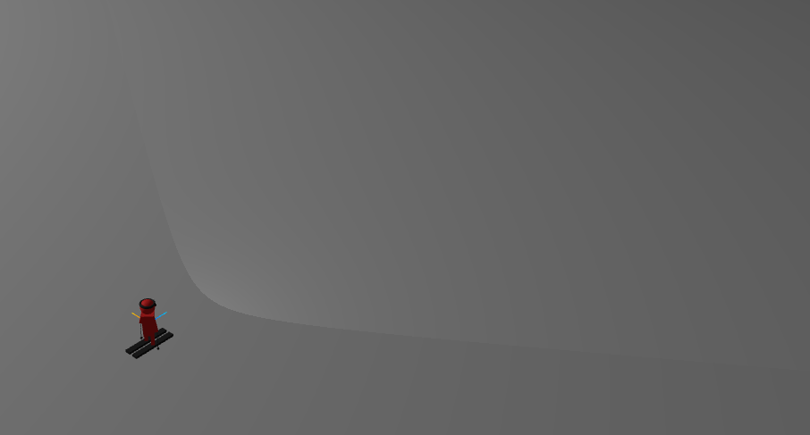

# 15/03/2025

Tasks:

- Improve the Character's model

Thoughts:

Despite Copilot's efforts being very good for a start, and to give me a structure of what I should do, it is now necessary for me to improve what we have. For starters, I need to divide the legs in 2 pieces, so that I can bend knees, and I need to place the arms in a more realistic place. I need to make the chest a bit thinner, as well as other parts, and especially the skis. The eyes need to be more attached to the head and I also need to place a headlight on the stickman's head.

---

I have improved the stickman, altough I have not done 2 leg pieces. This is a good start and next up I'd like to be able to make the stickman move. I need to figure out how to make him change stances depending on what he's doing.

In order to do this, I will implement the Perspective 1st person camera now.

---

I was able to implement movement and I did a 3rd person camera. Initially it was a 1st person camera but I realized i need something to allow me to have a notion that I am in the first person camera (such as the arms / sticks on the sides) and I didn't want to go there yet, so I switched my plans to make a 3rd person camera

The movement will naturally be changed later, the camera might suffer some changes too but the basics are down which leaves me very happy. In the future, there will be more strafing than sharp turning, but that is something that will put on hold for now.

I also had to create a new variable that recorded the last camera change, whenever I pressed the C key it would "spam" changes, because the key was being detected down multiple times. Now the camera can only change every 50ms. This solved the issue.

The next step is to move on to other models, and return to this one later.