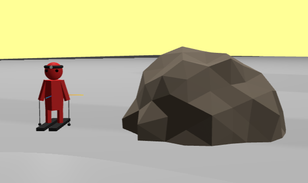
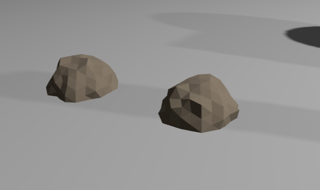
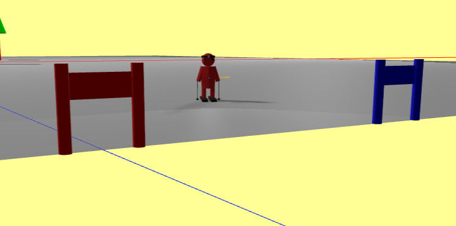
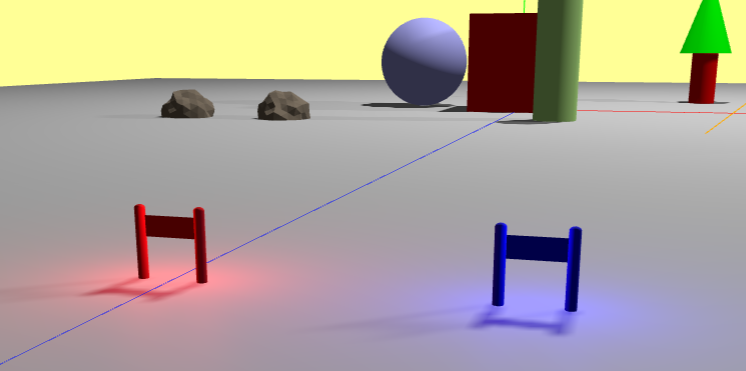

# 16/03/2025

Tasks:
- Make the gate model
- Make the rock model
- Make the pole model
- Make the spotlight model (optional for today)

Thoughts:

Today I will make 3 simpler models than the character model. I bet there is a rock model available online that I can steal. If that is the case, I will use it and document here the source. 

For the gate model, in principle it's just 2 cylinders and a block connecting them, with alternating colors, as well as pointlights on top of the cylinders, the problem being that if I want to implement some sort of physics to the gates (like the block being more like a plastic thing that is affected by gravity, and the gate being hit by the skier) it will probably be much more difficult.

For the pole model it will be a cylinder with a sphere on top. I don't think it is worth overcomplicating things.

I will implement the spotlight machines as well if there is time today.

----

I could not find a three.js library or file that would create a rock, however I managed to get ChatGPT to help me create a rock. I purposefully place this rock in y = 0 so that only half of it can be seen (like a rock placed on the ground). Each time a rock is generated, it comes out in a different shape.

I can use the scaling to manipulate the shape of the rock, something I will do when I'm generating them on the track.

------

I was also able to create the gates.

I took the chance and added some point lights to the gates. They will be visible at night.

------

In doing this, I discovered an issue with the lighting - the lights only showed up for one of the cameras and not the other, particularly the 3rd person camera did not show most of the lights.

I found out this is happening because since I attached the camera to the headlight on the character's mesh, it does not catch other lights at all. The only light it catches is the headlight, altough it does catches shadows from other light sources.

Previously, I had the 3rd person camera in the character's group and looking at (0, 0, 0), but instead I will just change the camera's position while the character's position changes and set it to look to the character as well.

------

I have hit my first wall, I have found a solution (a youtube video tutorial on how to make a third person camera) the issue is, the way my main file is setup, it is nearly impossible to implement that tutorial or any 3rd person camera smoothly. I have decided that I need to figure out good practices for developing these kinds of projects (do I need classes, what classes, how to do things) before moving along. It is important that things are done well in order for me to not run into more of these issues further on.

With this said, my new task is **research how people usually make programs in three.js, particularly games and refactor my code to reflect those good practices**. This process begins tomorrow.

