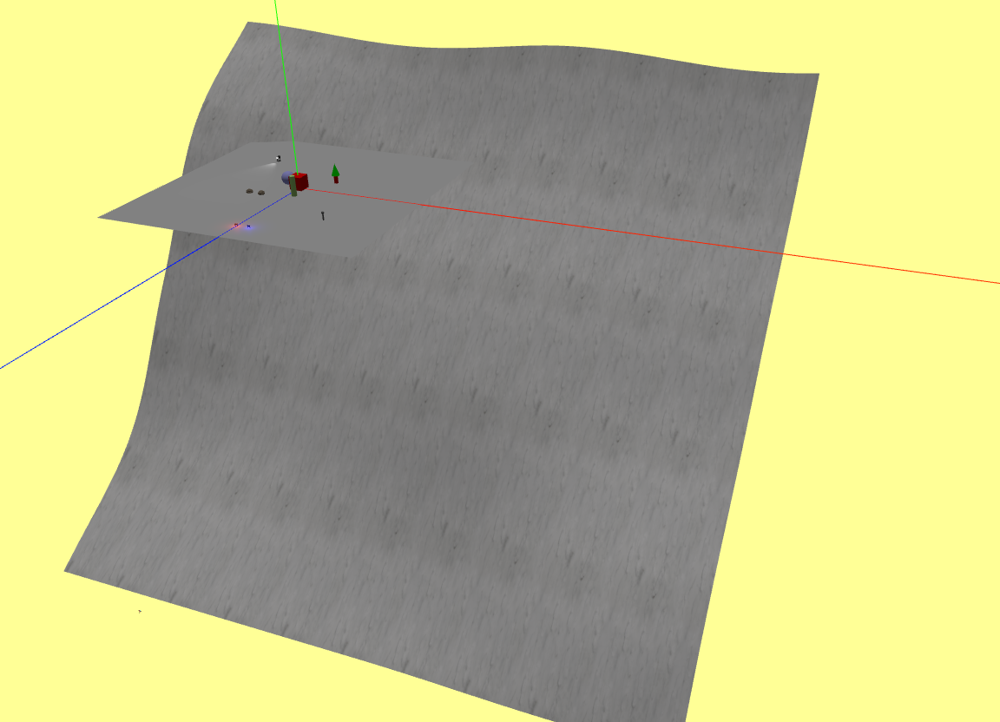

# 17/03/2025

Tasks:
- Make the floor model

Thoughts:

Today I will make the floor. It's more than just a plane because the floor, it's an inclined mountain. I will need to generate many instances of this as the skier will keep going down. It needs to be somewhat large as well, to avoid having to generate multiple instances of this. 

The better way to do this is to make the mountain itself - or at least a chunk of it - and create methods to place the gates and obstacles following an algorithm. I don't want the mountain to just go straight ahead at all times, it can have slight deviations to the right or left and also be more or less steep. We can make these random in the constructor or have it be an argument passed onto the constructor. The benefit of the latter is that we can make more customizable scenarios, such as different difficulty levels, altough the former probably makes the code cleaner.

the mountain itself looks fine. I have taken the opportunity to try and implement the skier's movement on the mountain but it's proving to be a difficult task. If I see that it is too difficult, I might have to postpone this (important) task until later.

For now, in attempting to do this task, the skier movement is completely broken.

-------