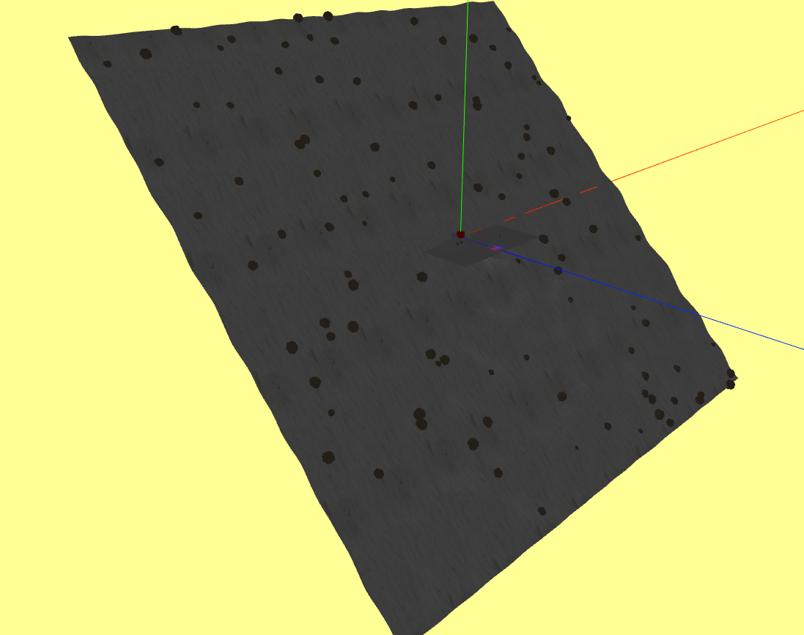
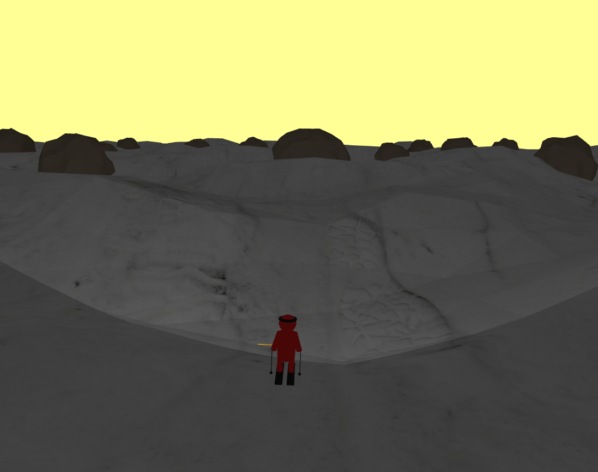

# 18/03/2025

Tasks:
- Continue working on the skier's movement on the mountain plane

Thoughts:

This is proving to be a really difficult task. Altough raycasting worked well, the skier can still easily clip through the floor, as I have not yet found a way to reliably place it above the floor. Again, the lack of code organization is also making things harder, making me wonder yet again if I should have refactored my code earlier. As we still have a somewhat long amount of time until the project delivery, this might be an important step to take. I am also starting to touch on subjects not taught in practical classes, making this all much harder than the previous tasks.

I am also making it difficult on myself by not following my own roadmap I had set in the beggining, but I suppose that is how my brain works. In other news, I managed to generate rocks into the mountain plane:

I also slightly adjusted the rotation of the skier when turning. I should adjust the 3rd person camera because it is following the skier's rotation when it shouldn't. A task for tomorrow, perhaps. With the rocks in place, I can also begin thinking how to detect collision with rocks, and make the skier "lose" or reset if there is a collision with a rock.

And yes, the game is already fun and it's not that hard to dodge the rocks but quite fun :)