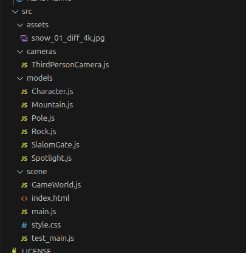

# 19/03/2025

Tasks:
- Figure out how to refactor the code into classes / modules

Thoughts:

I am on the 6th day of the project, which needs to be delivered in 2 months, with a checkpoint presentation sometime next month. With some difficulties being presented to me which could maybe be solved with some tutorials, but are hard to just implement due to how I've structured my code, I figured perhaps now, while I'm ahead in terms of progress, is the time to refactor my code.

I already had classes for the different models, as well as the camera, so the main challenge is update the game scene, camera management and other scene related things by converting those to classes. Therefore, today's work will be less oriented towards visible results and more about changing the structure of my code.

-----


After a long while, I managed to accomplish this. Now things are separated, and the game behaves similarly as before, with some detriment to the skier's turning which I'm attempting to fix, and I am unable to make big bumps on the mountain for some reason as well.



everything is properly separated in models, and the code for the main file is now simply:

```javascript
import GameWorld from '../scene/GameWorld.js';

new GameWorld();
```

Maybe I modularized things a bit too much! Alas.
