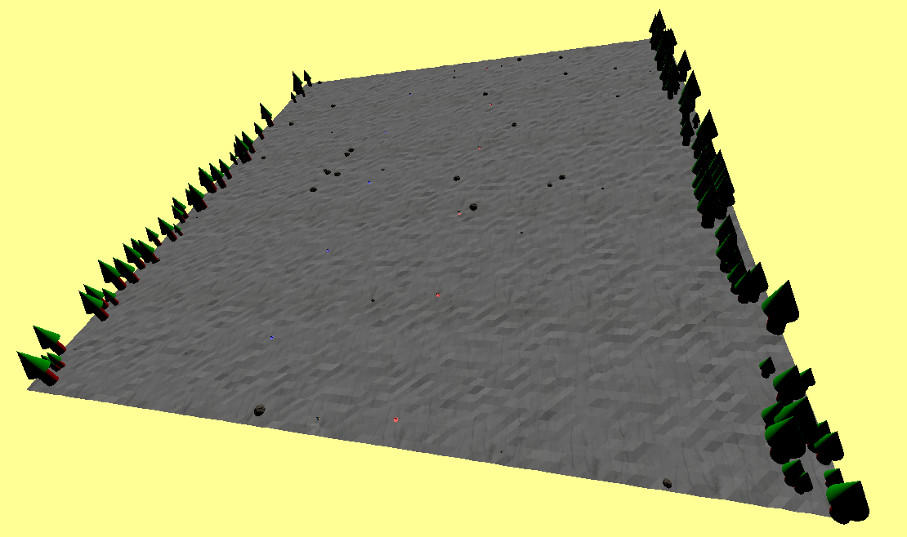

# 21/03/2025

Tasks:
- Place gates and trees on the mountain
- Implement (efficient) method of generating mountain sheets in front of eachother

Thoughts:

There are some rules to placing gates and trees on the scenery.

1. The gates must be alternating between left and right, and alternating colors as well. I can't make something that makes the gates too easy too reach, nor too hard, but also not too easy, all having in account that rocks will be generated along the way.

2. The trees need to be on the edge of the mountain sheet. The skier cannot go there. Need a lot of trees covering that area so that it's clear that you're not supposed to go there

Regarding efficient generation, I had already experimented with this before and the mountain sheets made the game to lag a bit whenever both were on the set. I will try to make it better but for now I'm not too concerned about it. Since the refactoring I have not yet experimented doing this infinite generation but we'll try in this step.

-----

I managed to place the gates and the trees, and added a directional light (the sun), and I'm now working on generating more terrain. Worth noting that generating a lot of trees on the sides made the site very slow, so I need to work on improving that (probably by using the Flyweight pattern)