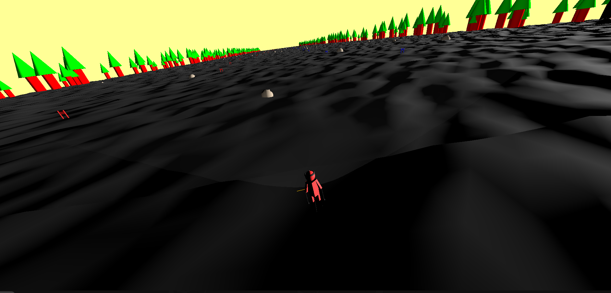
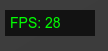

# 22/03/2025

Tasks:
- Implement infinite terrain generation
- Begin task of tracking score (going through the gates in the correct order in the correct place)

Thoughts:

I was able to implement some sort of infinite terrain generation:

However it came with the issue that I seem to have **too many lights** on the scene, caused mostly by the lights used by the gates. I will need to find a way to override this, of course. Also the snow is still dark for some reason. These things are things I don't want to deal with just yet.

In order to keep track of the skier's score, I need to:

1. Know where the next gate is
2. Know where the skier needs to go through
3. Know whether the skier skipped a gate
4. Keep track of this count

I am also wondering if I can keep some sort of velocimeter in the screen, to be investigated.

-----

I also added an FPS counter, should be useful for development

