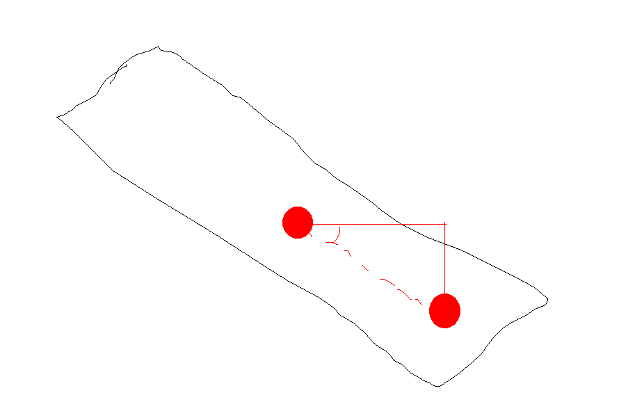
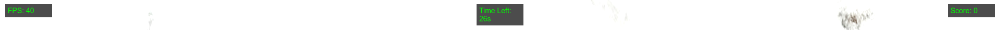

Tasks:
- Continue working on the skier's score

Thoughts:

This is proving to be a really difficult task. For some reason, which I can't seem to comprehend, the position of the gates is all messed up. Because the gates are connected to the mountain, and not even to the plane, with all the rotations and such, their position relative to the plane make it so that their absolute position is not the same as their relative position. Therefore, comparing the gates's position with the skier's position is a challenge.

Hence why I've been trying to do this for 3 days now!

The AxesHelper helped me visualize the planes. What I am looking for is the NEGATIVE y-axis value. Even then, weirdly enough the z-distance is still not quite right.

Randomly during the night I realized the issue: while the z axis from the skier moves horizontally, the plane's y axis is not horizontal, it's merely aligned with the plane's inclination. Therefore, what I need to do is get the skier's position, and calculate the distance the skier moved using the skier's z position and the plane's inclination.

This picture helps depict that what I want is to multiply the skier's z position with the plane's inclination, in order to get the skier's position relative to the plane.

---

I managed to finally make the skier and gates position be in sync after realizing the issue - and with that, implementing a scoring system and a timer was also trivial. Of course I'd like something more complex, but the scoring currently is a bit weird, sometimes not recognizing the skier going through a flag, and sometimes giving / taking away too many points, so I'd like to make that part "smooth" first.

