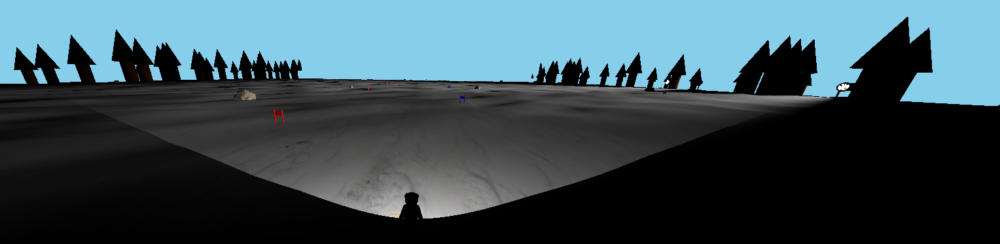

# 26/03/2025

Tasks:

- Make improvements to the scoring system and the skier's movement

Thoughts:

The basics are down - but there are still some issues to iron out. Firstly, the skier's movement is a bit cheated, as it's basicly just the skier glued to the floor (floating a bit). I'd like to be able to more accurately place the skier on the ground and prevent him from crossing the ground, while also allowing things like jumps and leaving the ground. The turning is also still a problem, as the skier can turn just a little sometimes and other times turn enough to go backwards. Truly weird stuff.

As for the score, which is more critical, sometimes a gate is accounted for twice, sometimes no times, sometimes correctly. I believe this is due to the fact that sometimes the fps lags a bit and screws everything up - I need to figure out a way to reliably calculate the score.

I discovered that the poor turning was due to the skier turning during noisy places of the terrain, applying the rotation not against the z-axis direction, rather against the direction it was already facing, making it emphasise the sharp /unsharp turning

While those issues remain unresolved, at least I added some spotlights to the scene:

Need to be careful about these as they are light sources.

Solving the skier's movement and fixing the score might prove to be a difficult task.
